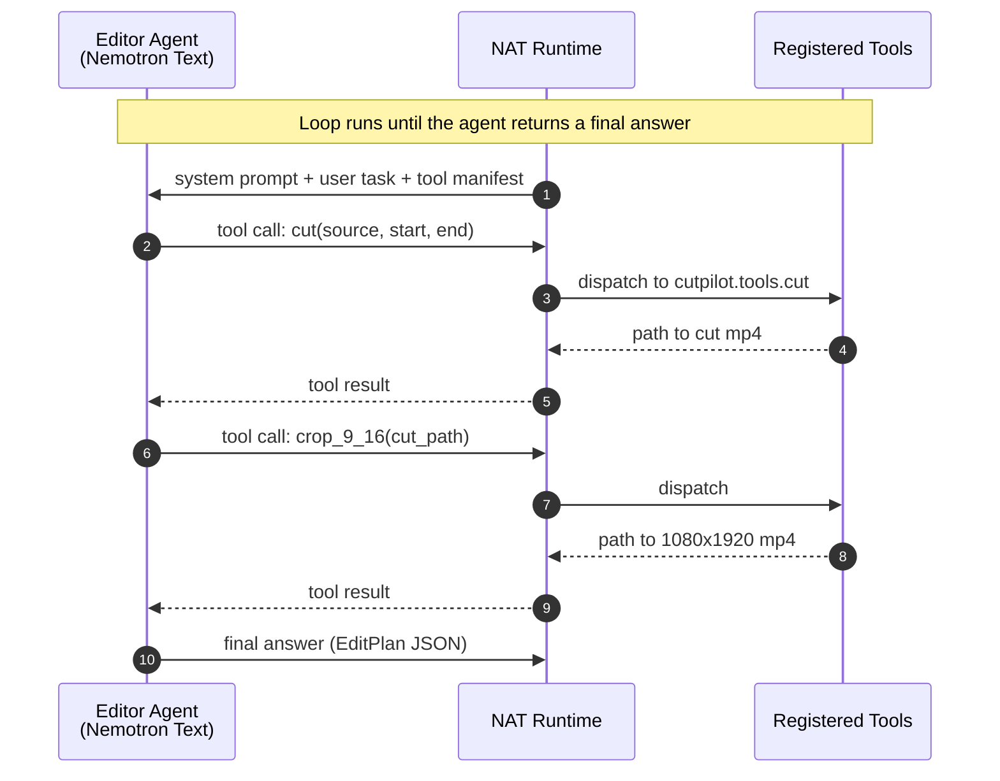

# CutPilot

Agentic long-video → short-clip generator. Drop in a 5–90 minute podcast, lecture, interview, or keynote and get back three 30–60 second vertical clips plus a stitched highlights reel — each with a hook, scored rationale, optional burned-in captions, and the full reasoning trace that picked the moment.

Built for NVIDIA Nemotron Developer Days Seoul 2026 — Track A (Creative Agentic Systems).

## Demo

[](https://youtu.be/TyfDE2Gj9BQ)

## How it works

A three-NIM pipeline orchestrated through the **NVIDIA NeMo Agent Toolkit** (`nvidia-nat`). Every model call hits a live NVIDIA NIM over its OpenAI-compatible `/v1` interface — no local weights, no LLM mocks:

1. **Whisper-Large ASR NIM** transcribes the source in 5-minute chunks with word-level timestamps and stitches them back into a single `Transcript`.
2. **Nemotron Nano 12B V2 VL NIM** runs in parallel over sliding 90-second windows covering the full video. Each window returns a 1–5 visual score and a one-sentence visual hook. Sliding scan avoids the pattern-collapse a single VL pass exhibits on long talks (everything becomes *"a woman on stage"*).
3. **Nemotron-3 Nano text NIM** sees the full transcript + the per-window VL observations and proposes 5–10 candidate clips via `client.beta.chat.completions.parse(response_format=CandidatesResult)` — Pydantic strict-mode JSON, not free text.

```mermaid
flowchart LR
    S[source<br/>file · URL · upload]
    S --> A[extract_audio<br/>ffmpeg]
    A --> W[Whisper NIM<br/>word-level transcript]
    S --> VL[Nemotron VL NIM<br/>sliding 90s windows<br/>parallel · in-video scoring]
    W --> T[Nemotron Text NIM<br/>proposes 5–10 candidates]
    VL --> T
    T --> E[Editor agent<br/>picks top 3 · cut or splice plan]
    E --> F[ffmpeg<br/>cut · crop 9:16 · optional captions]
    F --> O[outputs/&lt;run&gt;/<br/>clip_{1,2,3}.mp4<br/>highlights.mp4<br/>*.manifest.json]
```

The Editor picks the top 3 by composite rubric (`hook + self_contained + length_fit + visual_fit`), refines boundaries against the transcript, and emits an `EditPlan`. The server dispatches each step (`cut | splice → crop_9_16 → burn_captions?`) via `clients/ffmpeg.py`. A stitched `highlights.mp4` joins all three.

## Status

Finalized on `main`. End-to-end verified against the live NIMs on a 43-minute GTC Healthcare talk: 9-chunk Whisper transcription → 15-window parallel VL scan → 6-candidate text scout → 3 content-grounded clips (e.g. *"What if AI could design life-saving drugs in minutes?"*, *"What if robots could perform surgery with human-level precision?"*) + 42 MB `highlights.mp4`, all in ~3 minutes of wall-clock.

Test coverage (all against live dependencies, no LLM mocks):

- **96 unit tests** — models, parsers, prompt rendering, sliding-window math, URL gating, SRT emission. <3 s.
- **16 integration tests** — real ffmpeg subprocess + live VL / text / Whisper NIMs on a 120 s slice of real content. ~25 s.
- **1 e2e test** — full `run_pipeline` on the 43-min GTC video. Opt-in via `pytest -m e2e`, ~3 min.

## Requirements

- Python 3.11+ (dev env pinned to 3.13 via `.python-version`; `ruff` and `mypy` both target `py313`)
- `ffmpeg` 6.0+ on `PATH` (any build — the caption renderer works without libass / libfreetype)
- Three NVIDIA NIM endpoints reachable over HTTPS (configured in `.env`):
  - **Whisper-Large** (OpenAI-compat `/v1/audio/transcriptions`)
  - **Nemotron Nano 12B V2 VL** (OpenAI-compat `/v1/chat/completions` with video input)
  - **Nemotron-3 Nano text** (OpenAI-compat `/v1/chat/completions`)

  Hosted at `build.nvidia.com` with `NVIDIA_API_KEY`, or self-hosted on an **NVIDIA Brev** H100 Launchable (≥70 GB VRAM) with containers from `nvcr.io/nim/...` pulled via `NGC_API_KEY`. See [.env.example](.env.example) for the full contract.

## Install

```bash
pip install -e ".[dev]"
```

Then copy `.env.example` → `.env` and fill in the three NIM endpoints.

## Run

```bash
cutpilot <source.mp4>                          # local file
cutpilot https://youtu.be/<id>                 # yt-dlp handles URL ingest
cutpilot /path/to/video.mp4 --run-id demo      # custom run id (= output subdir)
cutpilot <source> --burn-captions              # burn captions onto the clips (opt-in)
```

Clips, per-clip manifests, and `highlights.mp4` land under `outputs/<run>/`; caption text is always saved into each manifest, whether or not the pixels are burned in.

To serve the review UI over HTTP and accept uploads from the browser:

```bash
cutpilot-serve                 # defaults to http://127.0.0.1:8080
```

The declarative NAT workflow at `src/cutpilot/configs/cutpilot.yml` can be exercised directly:

```bash
nat run --config_file=src/cutpilot/configs/cutpilot.yml --input <source>
nat info components            # lists every @register_function tool + Scout
```

## Review UI

Single-file HTML at `ui/index.html` — Tailwind via CDN, Inter + JetBrains Mono, dark-on-light palette with the brand red (`#fc3f1d`) as the live-state accent.

Each run renders three video players side-by-side. Per clip:

- The vertical 1080×1920 mp4
- Hook (one-line title the agent picked)
- Rationale (multi-sentence justification)
- Four rubric bars (hook / self-contained / length / visual)

Press **`e`** on a focused clip to toggle the full reasoning trace — every Scout candidate, why it won or lost, and the Editor's boundary refinement. Space / arrows control playback on the focused video. Append `?demo=1` to hide dev-only noise.

Two ways to open it:

- **`file://`** — open `ui/index.html` directly in a browser; it reads manifests straight from `outputs/<run>/`.
- **`cutpilot-serve`** — FastAPI at `src/cutpilot/server.py` mounts `ui/` at `/` and `outputs/` at `/outputs`. Exposes `POST /runs` (URL or path), `POST /runs/upload` (multipart), `GET /runs/{id}` (status + manifests). Run state lives in an in-memory dict — single-worker, single-user, lost on restart.

## Architecture & file map

Three layers stacked vertically. Top runs the flow, middle decides the content, bottom does the work.

| Layer                   | What it does                                                   | Key files                                                                                  |
|-------------------------|----------------------------------------------------------------|--------------------------------------------------------------------------------------------|
| **Pipeline (Python)**   | Deterministic orchestration — resolve source, transcribe, delegate to agents, stitch | `src/cutpilot/pipeline.py` · `src/cutpilot/cli.py` · `src/cutpilot/server.py`              |
| **Agents (LLM)**        | Scout picks candidate moments; Editor writes the cut plan       | `src/cutpilot/agents/scout.py` · `src/cutpilot/agents/editor.py`                           |
| **Tools (ffmpeg + transcript)** | Small callable units the agents invoke; the only code that shells out to ffmpeg | `src/cutpilot/tools/` (cut · crop_9_16 · burn_captions · transcript_window · splice · merge · save · probe) · `src/cutpilot/clients/ffmpeg.py` |
| **NIM clients**         | OpenAI-compat callers for Whisper, VL, Text — SSoT per endpoint | `src/cutpilot/clients/whisper.py` · `src/cutpilot/clients/nim.py` · `src/cutpilot/clients/youtube.py` |
| **Workflow config**     | YAML declaring `llms:` / `functions:` / `workflow:` for `nat run` | `src/cutpilot/configs/cutpilot.yml`                                                        |
| **System prompts**      | Scout + Editor system prompts, loaded at runtime                | `prompts/scout.md` · `prompts/editor.md`                                                   |
| **Data models**         | Every Pydantic type that crosses an agent boundary or hits disk | `src/cutpilot/models.py`                                                                   |
| **Review UI**           | Static HTML + JS; reads manifests, renders players + trace      | `ui/index.html`                                                                            |

## How the NAT agent loop works

Three pieces do the work:

1. **Tool registration.** Every tool is a plain Python async function decorated with `@register_function`, plus an entry in `pyproject.toml`'s `[project.entry-points."nat.components"]` table. Running `nat info components` lists the lot. Entry-points are read *at install time*, so add a new tool and you must `pip install -e .` before `nat` sees it.
2. **Agent declaration.** The workflow YAML (`src/cutpilot/configs/cutpilot.yml`) declares a `tool_calling_agent` bound to a text LLM with a `tool_names` list — for CutPilot, that's the Editor using the four materialization tools (`cut`, `crop_9_16`, `burn_captions`, `transcript_window`). NAT constructs the loop from that spec; there's no agent class to subclass.
3. **The loop.** NAT feeds the agent its system prompt, the user task, and a tool manifest generated from each tool's type-annotated signature. The agent emits JSON tool calls; NAT dispatches each call to the registered Python function; the return value goes back to the agent as the tool result. The loop runs until the agent emits a final answer.



Current CutPilot wrinkle: the CLI drives a simpler Python path (`scout_vl_sliding → scout_text_core → top-3 → editor_core → ffmpeg`) instead of `nat run`, because NAT's `sequential_executor` returns a text blob and takes a single string input — it can't deliver `list[ClipManifest]` back to the caller. `nat run --config_file=src/cutpilot/configs/cutpilot.yml --input <source>` still works as the canonical declarative view.

## Development

```bash
pytest                                          # unit + integration (live NIMs auto-skip when down)
pytest -m "not integration and not e2e"         # unit only — fast, hermetic
pytest -m integration                           # real ffmpeg + live NIM (~25 s)
pytest -m e2e                                   # full 43-min pipeline on the GTC video (~3 min)
ruff check . && ruff format .                   # lint + format
mypy src                                        # strict type check
```

## Scope

**In:** one source file (`.mp4` / `.mov` / `.mkv`) or YouTube URL, English audio, single primary speaker, 3 vertical clips with reasoning trace, center-crop framing, stitched highlights reel, optional burned-in captions (`--burn-captions`).

**Out for the sprint** (deferred to post-hackathon): smart crop with face tracking, scene-detection tool, multi-language output, word-level caption highlighting, Korean-language sources, multi-speaker handling, social platform publishing, batch processing.

## Authors

Sergey Leksikov · Minjae Kim

## License

MIT
